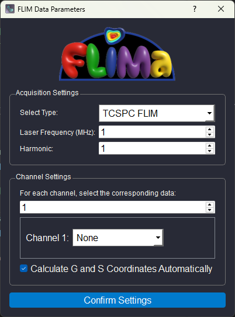
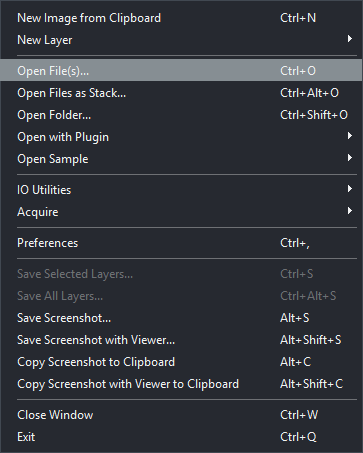

Getting Started
===============

Installation
------------

1. Fetch the package from Github:

    :code:`git clone https://github.com/ashsolano/napari-flima.git`

2. Install dependencies:

    .. code-block:: bash

        # navigate to the flima root directory
        cd ./napari-flima 
        # dependency install requires setuptools
        pip install .

3. Running FLIMa:
   
   To run FLIMa ensure that you've navigated to the napari-flima root directory, then run the GUI script: :code:`.\run.py` 

    .. code-block:: bash

        python run.py

4. Report any issues on the Github repository ensuring you cite the package version and including your python environment details

Configuring FLIMa
-----------------

Intro Dialog
~~~~~~~~~~~~

Opening Files
~~~~~~~~~~~~~
.. image:: napari-main-widget-empty.png

