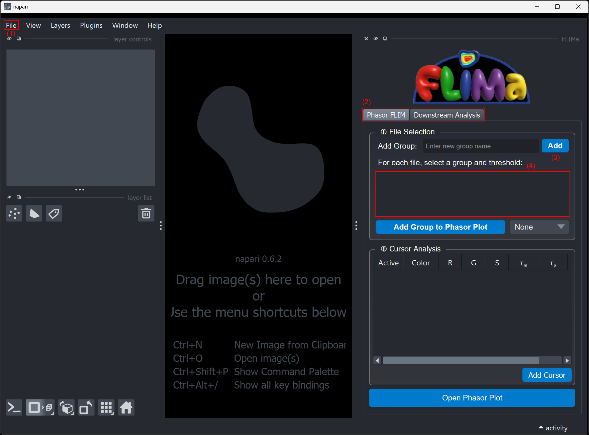
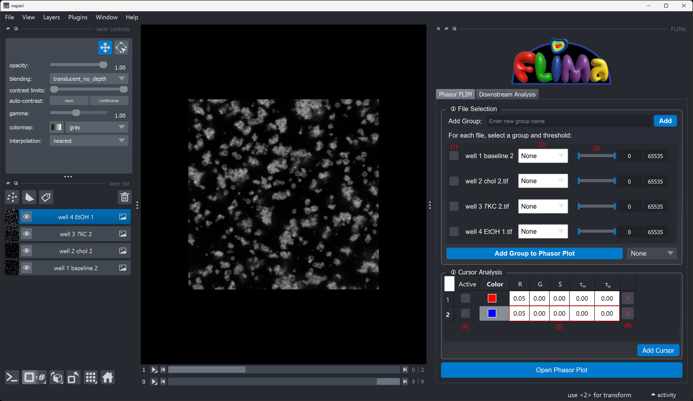
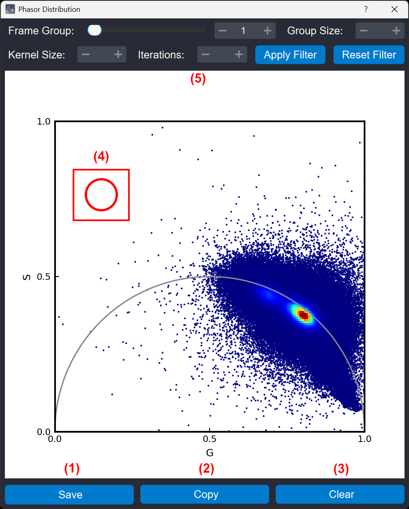

.. _usage:

Usage
=====
Analysis in FLIMa is split into two parts available from the tabs at the top of the FLIMa widget panel on the right side of the :code:`napari` GUI (:ref:`dialogU-a`.2):

.. _dialogU-A:

    Fig A

    (napari GUI with FLIMa widget on the right; widget tabs highlighted at (2))

.. _dialogU-B:

    Fig B

    (napari main GUI with FLIMa Phasor FLIM widget including example data)

Navigating the GUI
------------------
The two tabs of the FLIMa widget (:ref:`dialogU-a`.2) separate the stages of analysis into data preparation and FLIM Phasor analysis, and downstream analysis functions and report generation. When files are added to :code:`napari` as mentioned in :ref:`setup` they will appear as images on the left and as a list of files in the file selection widget of FLIMa (:ref:`dialogu-a`.4). All analysis performed with FLIMa will occur in the plugin section that contains these widgets and the various windows that will be created throughout. Any changes made with the layer controls in :code:`napari` are not guaranteed to be reflected in the analysis performed by FLIMa unless explicitly mentioned.

Image Management
~~~~~~~~~~~~~~~~
The Phasor FLIM tab is further split into File Selection and Cursor Analysis. When populated with files, File Selection will include a row for each file. Each file can be individually added to the analysis using the checkboxes (:ref:`dialogU-b`.1). Groups can be assigned to files using the dropdown (:ref:`dialogU-b`.2), and new groups can be added if necessary using the :menuselection:`Add` button. 

.. important::
    Make sure you've finished configuring a given file, including setting image thresholds before checking :ref:`dialogU-b`.1

Image Thresholding
~~~~~~~~~~~~~~~~~~
After all files have been loaded and assigned to groups but before they've been added to the analysis you are able to select upper and lower thresholds for the image intensity using the slider beside the given file (:ref:`dialogU-b`.3). Threshold values can be set by dragging the handles of the range slider or by typing them in manually in the boxes to the right of the slider.

Phasor Plot and Cursor Analysis
-------------------------------
The Phasor Plot projects the data into the polar (G,S) Phasor space where we will perform cursor-based analysis.

The Phasor Plot
~~~~~~~~~~~~~~~
To open the phasor plot click the button at the bottom of the widget which will open a new window :ref:`dialogU-c`

.. _dialogU-c:

    Fig C

    (FLIMa Phasor Plot dialog including example data and cursor)

Adding and Configuring Cursors
~~~~~~~~~~~~~~~~~~~~~~~~~~~~~~
To create a cursor click the button on the bottom right of the :menuselection:`Cursor Analysis` section. Each cursor can be assigned a colour (different colours should be used for each cursor if multiple are used), and enabled using the checkbox (:ref:`dialogU-b`.4) to the left of the cursor row. Cursor details are given in the table (:ref:`dialogU-b`.5) and can be manually adjusted before or after configuring the cursor in the phasor plot. Cursors can be removed with the [x] button (:ref:`dialogu-b`.6).

Using the Phasor Plot
~~~~~~~~~~~~~~~~~~~~~
For a detailed resource about phasor analysis and interpreting your data with phasor plots see one of these resources: [insert here]

After adding thresholded data, cursors (as many as there are expected species in the data is generally the recommendation) can be dragged over regions of interest in the phasor plot (:ref:`dialogu-c`.4). Points under the cursors are assigned the corresponding cursor colour in later analysis.

Three buttons are located at the bottom of the phasor plot dialog (:ref:`dialogu-c`.1-3):

* (1) Saves the phasor plot as a PNG
* (2) Copies the phasor plot to the clipboard
* (3) Removes all data from the phasor plot

Additional settings for the phasor plot are avialable at the top of the dialog (:ref:`dialogu-c`.5), once configuration and cursor analysis is complete, plots can be expoted using the buttons described above (:ref:`dialogu-c`.1-2) and/or the window can be closed.

Segmentation and Downstream Analysis
------------------------------------

Configuring and Running Segmentation
~~~~~~~~~~~~~~~~~~~~~~~~~~~~~~~~~~~~

Exporting Results
~~~~~~~~~~~~~~~~~

The HTML Report
---------------